# Robot Motion Planning
## Overview
This project is a part of coursework Planning and Learning done in Spring 2023.

This code implements A* search based planning and RRT sample based planning for a 3D environment. We are given 7 environments described as:
- All the blocks and the boundaries are given as axis-aligned bounding rectangles.
- Each rectangle is described by a 9-dimensional vector, specifying its lower left corner $x_{min}$ , $y_{min}$  , $z_{min}$  and, its upper right corner $x_{max}$  , $y_{max}$ , $z_{max}$ , and its RGB color (for visualization).
- A start point $x_s$ and goal point $x_d$ is given. The objective is to find a path between the start node and to
goal node without colliding with any obstacles.

The objective is to find a path between the start node and to goal node without colliding with any obstacles.

## Results
Visualization of A* results:

|           Flappy Bird            |            Maze            |            Monza            |
| :-------------------------------------: | :--------------------------------------: | :----------------------------------------: |
| 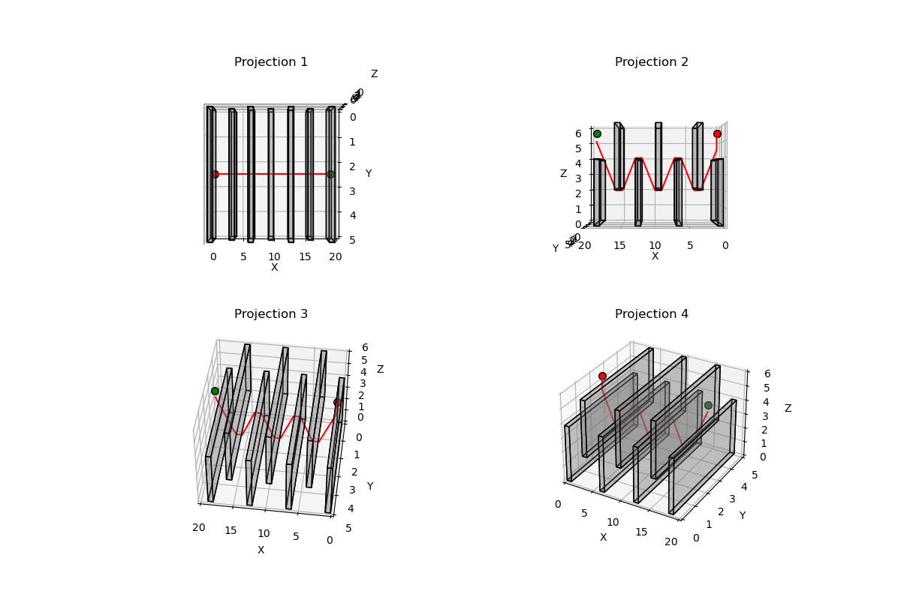 | 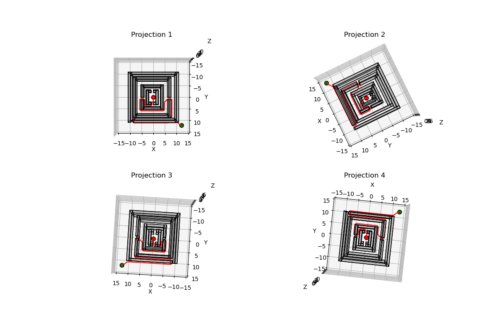 | 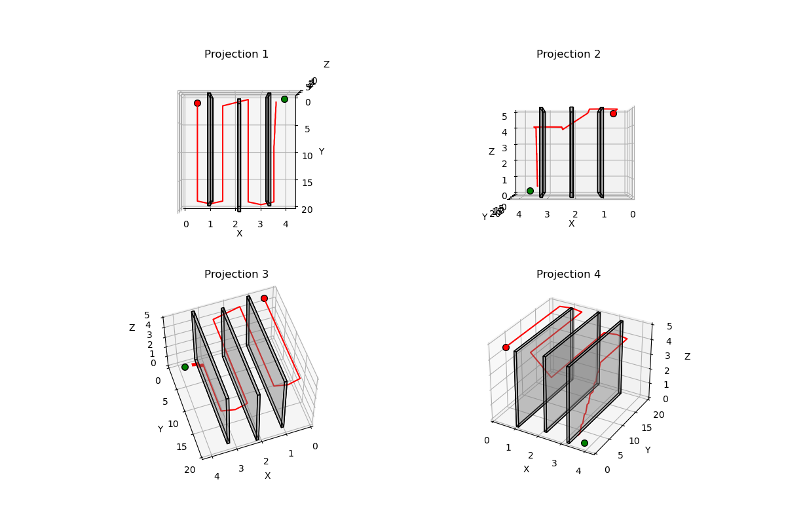 |

|           Room            |            Tower            |            Window            |
| :-------------------------------------: | :--------------------------------------: | :----------------------------------------: |
| 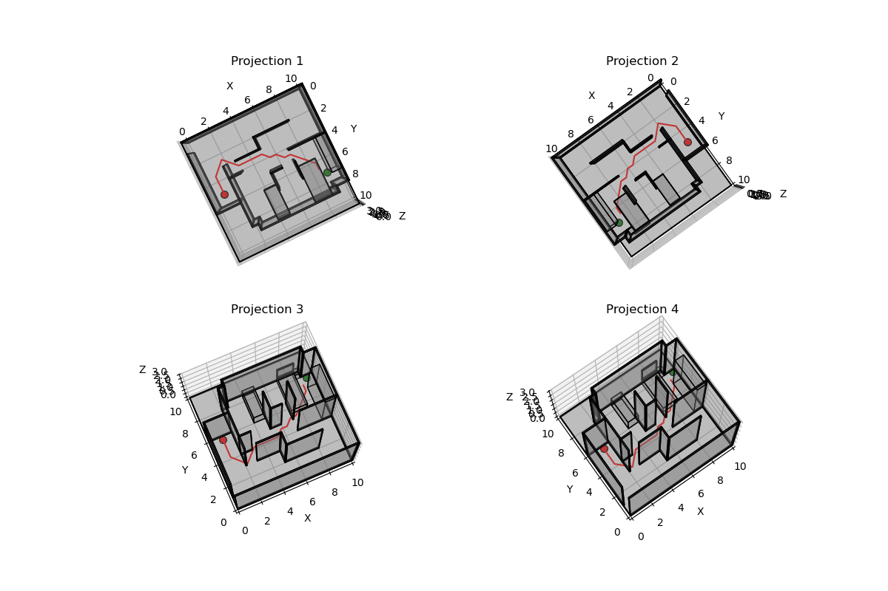 | 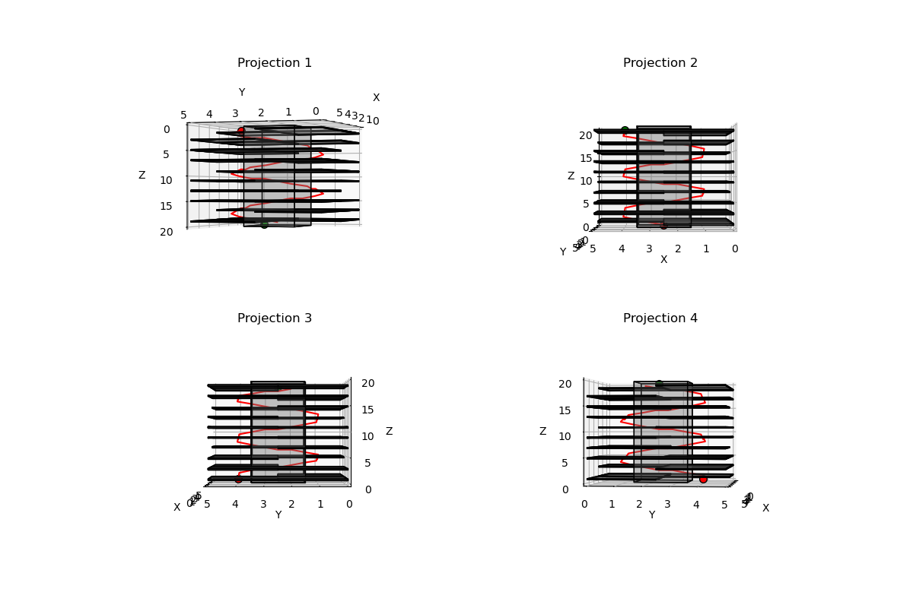 | 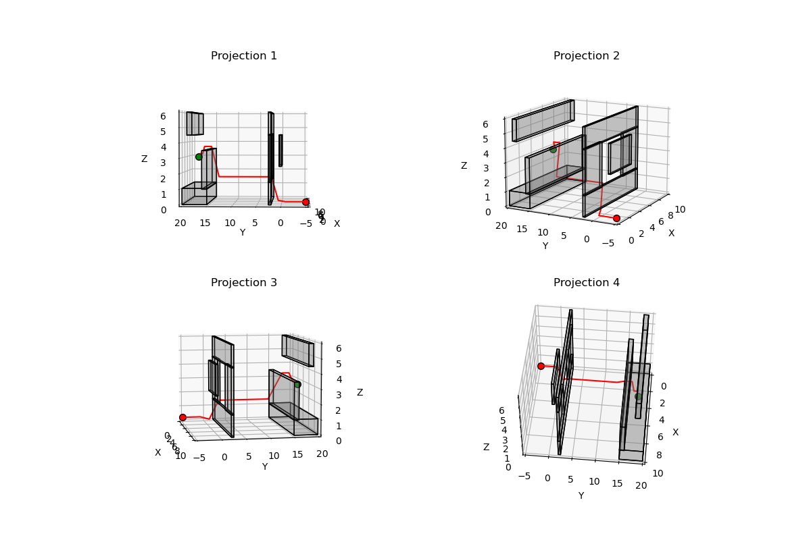 |

Visualization of RRT results:

|           Flappy Bird            |            Maze            |            Monza            |
| :-------------------------------------: | :--------------------------------------: | :----------------------------------------: |
| 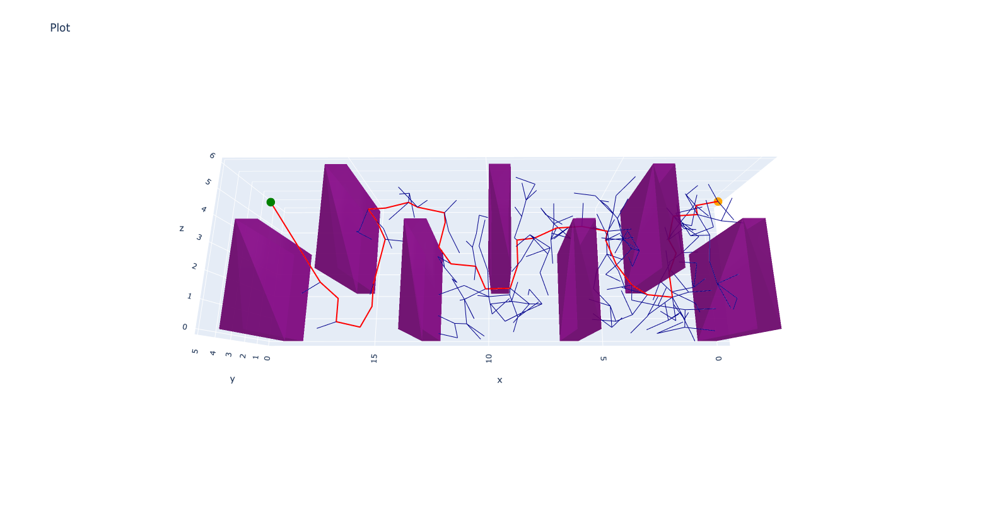 | 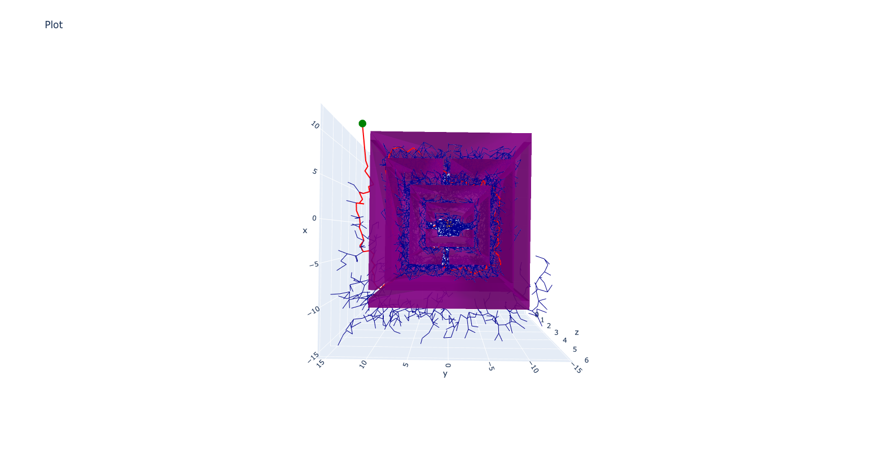 | 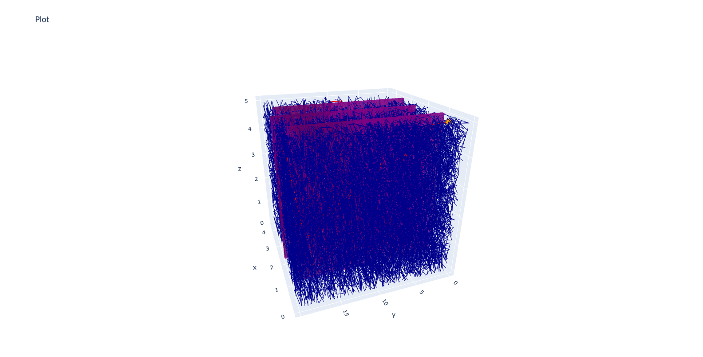 |

|           Room            |            Tower            |            Window            |
| :-------------------------------------: | :--------------------------------------: | :----------------------------------------: |
| 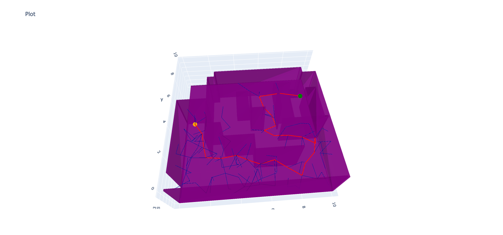 | 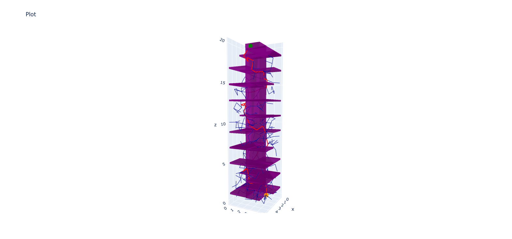 | 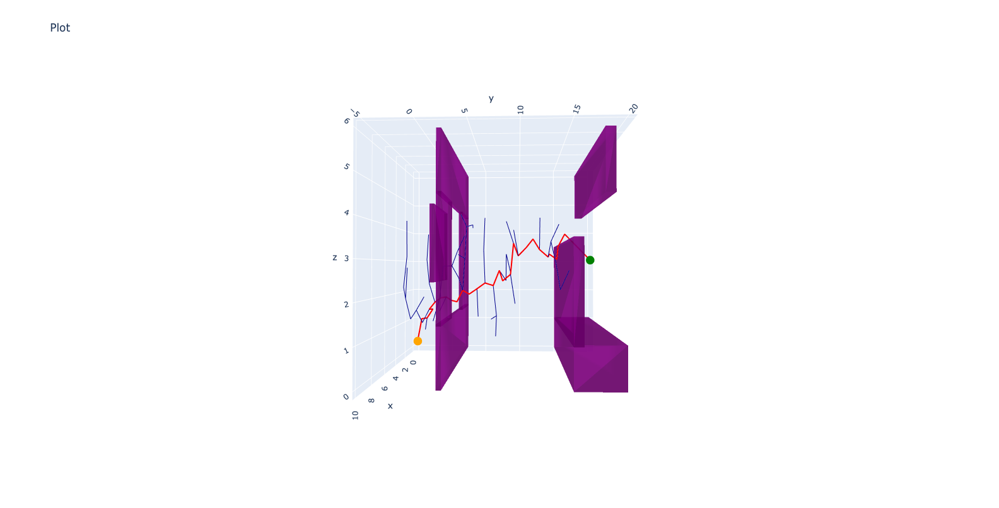 |

## Code Implementation
### 1. main.py
This file is the main entry point to the algorithm. Uncomment the testcase to see the visualisation.

### 2. my_astar.py
Class that implements A* algorithm and is being called in main.

### 3. my_rrt.py
Class that implements RRT algorithm and is being called in main.

### 4. RRT_source
This folder contains certain classic RRT algorithm implementations.

### 5. maps
This folder contains 7 test environments described via a rectangular outer boundary and a list of rectangular obstacles. The start and goal points for each environment are specified in main.py.

### 6. Results_Astar
This folder contains images of the output from Astar.

### 7. Results_RRT
This folder contains images of the output from RRT.
